**Version**: 1.0.0

**Update**: 2025-08-31
# STM32 RTOS Multi-Task System
This project is a firmware for STM32F4 boards (Open405R), using FreeRTOS and supporting various peripheral drivers like LCD, touch, FRAM, etc.
## Main Components

- **FreeRTOS**: Real-time operating system for STM32F4.
- **LCD Driver**: Control for ST7789 & HX8347 LCDs (`LCD_Driver.c`, `LCD_lib.c`).
- **Touch Driver**: XPT2046 touch controller (`touch.c`, `xpt2046.c`).
- **FRAM I2C**: I2C interface for FRAM memory (`fram_i2c.c`).
- **Interrupts & HAL**: Hardware abstraction and interrupt management via HAL.

## Software and Tools
- **STM32CubeMX**: A hardware configuration tool that automatically generates HAL code for peripherals such as GPIO, EXTI, and TIM, helping to shorten development time.

- **Keil µVision 5**: An integrated development environment (IDE) for ARM, supporting compilation, programming, and debugging for STM32.

- **STM32CubeF4 HAL Library**: A hardware abstraction library provided by ST, making peripheral operations easier, increasing compatibility, and reducing errors from direct register programming.
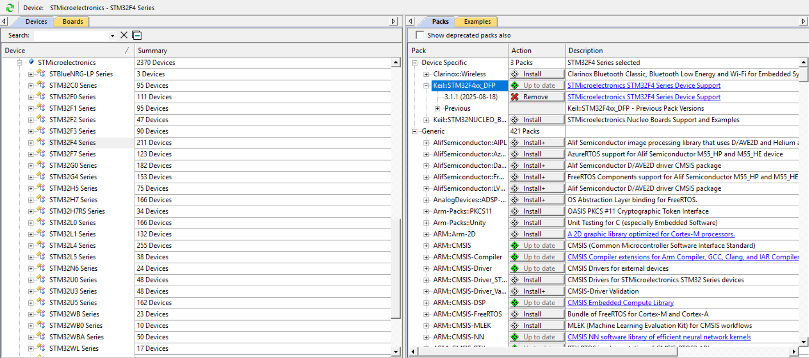

## Detailed Components
### STM32 Configuration

##### Pinout Configuration: 
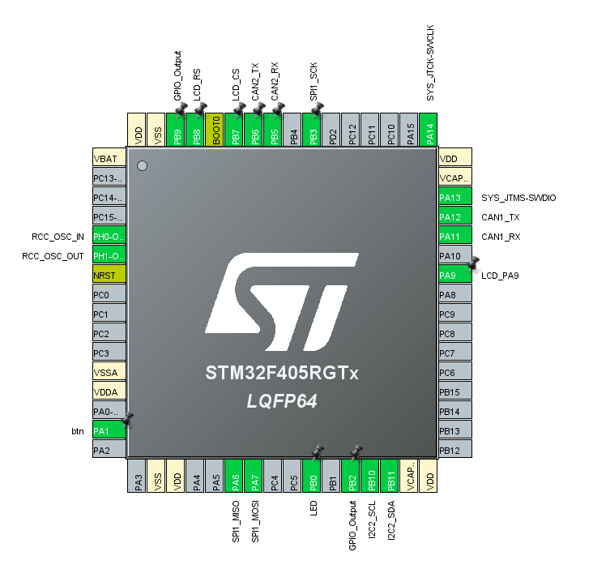

##### Clock Configuration: 
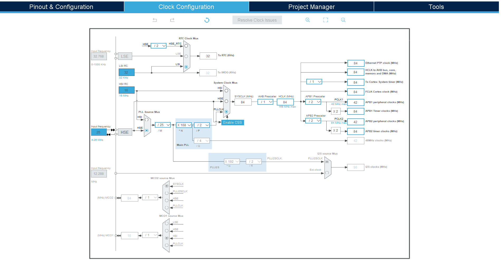

##### GPIO Configuration
Port GPIOB:
- LED_Pin: Function: Controls the LED to blink with a 1-second cycle in Task 02-1.
- LCD_CS_Pin: Function: Chip Select pin for selecting the LCD in SPI communication.

- LCD_RS_Pin: Function: Register Select pin (Data/Command).

Port GPIOA:

- btn_Pin: Function: Reads the button state for Task 02-3 (monitoring button press to write data into FRAM).

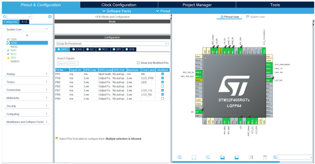

##### ADC Configuration

Purpose: Measure the internal chip temperature (ADC_CHANNEL_TEMPSENSOR) and reference voltage (ADC_CHANNEL_VREFINT) to calculate temperature for Task 02-2 and Task 02-3.

Configuration:

ADC1: Resolution: 12-bit. Scan mode: Enabled. Continuous conversion: Enabled. DMA is used to transfer data (AdcRaw[2]).

Channels:

- VREFINT: Rank 1, sample time = 480 cycles.

- TEMPSENSOR: Rank 2, sample time = 480 cycles.

Callback: HAL_ADC_ConvCpltCallback sets the AdcConvCmplt flag when conversion is completed.

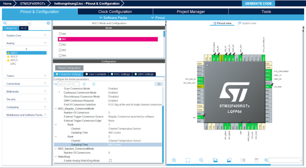

##### CAN Configuration

Purpose: Transmit messages from CAN1 and receive via CAN2 for Task 02-2 and Task 02-4.

Configuration:

- CAN1: Mode: Normal. Prescaler: 6. Timing: BS1 = 6TQ, BS2 = 3TQ, SJW = 1TQ. Filter: Accept all IDs (FilterIdHigh/Low = 0, FilterMaskIdHigh/Low = 0).

- CAN2: Same as CAN1, but the filter only accepts ID 0x123.

CAN Message: ID: 0x123 (Standard ID). DLC: 3 bytes (txdata[0] = 8, txdata[1] = integer part of temperature, txdata[2] = decimal part of temperature).

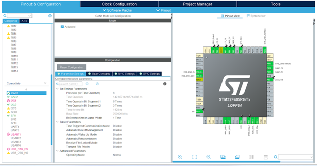

##### I2C (FRAM) Configuration

Purpose: Communicate with FRAM FM24CLXX memory to store temperature and time data in Task 02-3.

Configuration:

- I2C2: Speed: 400 kHz. Mode: 7-bit addressing. FRAM address: 0xA0.

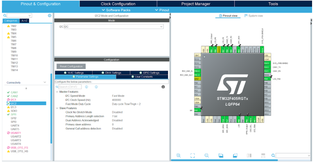

##### RTC Configuration

Purpose: Provide real-time clock for Task 02-3 to record data into FRAM.

Configuration:

- RTC: Hour format: 24-hour. Prescaler: Asynch = 127, Synch = 255. Default time: 00:00:00, Date: 1/1, Monday.

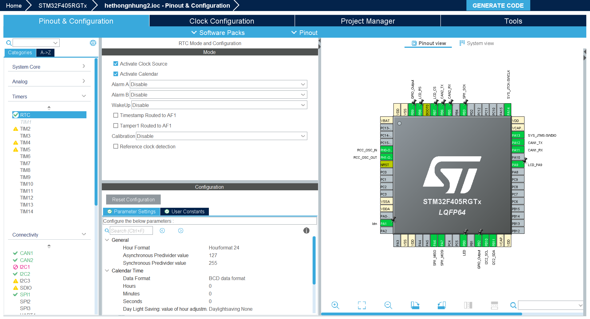

##### SPI (LCD) Configuration

Purpose: Communicate with the LCD for Task 01 and Task 02.

Configuration:

- SPI1: Mode: Master. Data size: 8-bit. Baud rate: Prescaler 16. Polarity: Low, Phase: 1-edge.
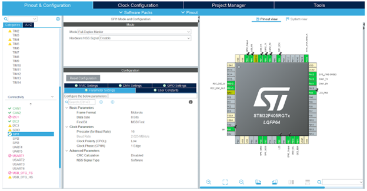

##### DMA Configuration

Purpose: Continuously transfer ADC data for Task 02-2 and Task 02-3.

Configuration:

- DMA2 Stream 0: Enabled for ADC1. Interrupt: Priority = 5, IRQ enabled.

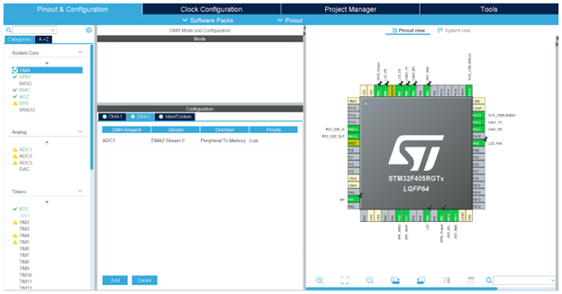

### Tasks

- **defaultTask (Task 01)**: Displays the main screen and handles touch input to navigate to the menu.
    - Priority: osPriorityNormal

    - Stack size: 1024 bytes

- LCD_Touch_Task (Task 02): Manages the menu interface and four touch zones.
    - Priority: osPriorityNormal
    - Stack size: 1024 bytes
- LED_Task (Task 02-1): Controls LED blinking.
    - Priority: osPriorityBelowNormal
    - Stack size: 256 bytes
- CAN_Task (Task 02-2): Handles CAN transmission and reception.
    - Priority: osPriorityAboveNormal
    - Stack size: 526 bytes
- Button_FRAM_Task (Task 02-3): Writes data to FRAM.
    - Priority: osPriorityBelowNormal
    - Stack size: 128 bytes
- Display_CAN_Task (Task 02-4): Displays CAN data.
    - Priority: osPriorityLow
    - Stack size: 128 bytes

#### Task Creation (in main()):
```C
osThreadDef(defaultTask, StartDefaultTask, osPriorityNormal, 0, 1024);
defaultTaskHandle = osThreadCreate(osThread(defaultTask), NULL);

osThreadDef(LCD_Touch_Task, LCD_Touch, osPriorityNormal, 0, 1024);
LCD_Touch_TaskHandle = osThreadCreate(osThread(LCD_Touch_Task), NULL);

osThreadDef(LED_Task, LED, osPriorityBelowNormal, 0, 256);
LED_TaskHandle = osThreadCreate(osThread(LED_Task), NULL);

osThreadDef(CAN_Task, CAN, osPriorityAboveNormal, 0, 526);
CAN_TaskHandle = osThreadCreate(osThread(CAN_Task), NULL);

osThreadDef(Button_FRAM_Tas, Button_FRAM, osPriorityBelowNormal, 0, 128);
Button_FRAM_TasHandle = osThreadCreate(osThread(Button_FRAM_Tas), NULL);

osThreadDef(Display_CAN_Dat, Display_CAN, osPriorityLow, 0, 128);
Display_CAN_DatHandle = osThreadCreate(osThread(Display_CAN_Dat), NULL);
```
#### Task Management

All tasks are created in main() using osThreadCreate.

Tasks LED_Task, CAN_Task, Button_FRAM_Task, and Display_CAN_Task are initially suspended and only activated when selected via touch input.

osDelay is used to prevent continuous CPU load.

Initial suspension of tasks:

```C
osThreadSuspend(LED_TaskHandle);
osThreadSuspend(CAN_TaskHandle);
osThreadSuspend(Button_FRAM_TasHandle);
osThreadSuspend(Display_CAN_DatHandle);
```
#### Task Implementation
**Task 01**: LCD Display and Touch Handling
- Function: Displays the main screen with group information and processes touch input to navigate to the menu (Task 02).
- Implementation:
    - Function StartDefaultTask displays group name "[NHOM 08]" and member list on the LCD.
    - Variable need_redraw_main ensures the screen is only redrawn when necessary to save resources.
    - Touch coordinates are read via tp_get_touch_point(&x, &y) and displayed on the LCD for debugging.

**Task 02**: Menu Interface and Touch Zones
- Function: Displays a menu screen with four touch zones to activate corresponding sub-tasks, along with a BACK button to return to the main screen.
- Implementation:
    - Function LCD_Touch manages the menu screen (current_screen == 1).
    - Touch regions are drawn as rectangles.
    - On touch detection, the corresponding task is resumed with osThreadResume, while other tasks are suspended using osThreadSuspend to prevent conflicts.

**Task 02-1**: LED Blinking (1-second interval)
- Function: Toggles the LED with a 1-second cycle (500ms ON, 500ms OFF).
- Implementation:
    - Function LED uses HAL_GPIO_TogglePin to change the LED state on the GPIO pin.
    - Runs in an infinite loop with osDelay(500) to maintain the blinking cycle.

**Task 02-2**: Sending and Receiving CAN Messages
- Function: Send a CAN1 message every 500 ms containing the group number and the on-chip temperature, then read the message back through CAN2.
- Implementation:
    - The UpdateTemperature function calculates the temperature from ADC data (AdcRaw[0] and AdcRaw[1]) using a given formula.
    - The temperature data is stored in temperature_data (integer and decimal parts).
    - The CAN function sends a message via CAN1 with txHeader.StdId = 0x123, where the data contains the group number (txdata[0] = 8) and the temperature (txdata[1], txdata[2]).
    - The HAL_CAN_RxFifo0MsgPendingCallback function processes the message received from CAN2 and displays it on the LCD.

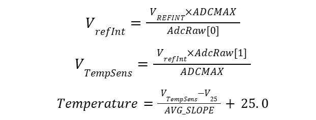

**Task 02-3**: Button Monitoring and Writing Data to FRAM
- Function: Continuously monitor a push button. If the button is pressed, write the current on-chip temperature into the FM24CLXX FRAM together with the timestamp.
- Implementation:
    - Button monitoring: Continuously check the state of a push button connected to btn_Pin on btn_GPIO_Port.
    - Writing to FRAM: When the button is pressed (transition from unpressed to pressed), the task will:
    - Read the on-chip temperature via ADC.
    - Get the current time from the RTC (Real-Time Clock).
    - Write the temperature data (integer and decimal parts) together with the timestamp (hour, minute, second, day, month, year) into the FRAM (FM24CLXX).
    - Status display: Update the LCD with messages, including when the button is pressed, FRAM write success/failure, or ADC timeout error.
    - FRAM address management: Increment the FRAM write address after each write and reset it to 0 if it exceeds the memory limit.

**Task 02-4**: Displaying CAN Data for 3 Seconds
- Function: Display the data received from CAN2 for 3 seconds, then return to the main screen.
- Implementation:
    - The Display_CAN function shows the message "[Group 8] + [Temperature]: %d.%d°C" on the LCD using data from RxData.
    - After 3 seconds (osDelay(3000)), the screen is cleared, current_screen is reset to 0, and the task suspends itself.

## Result
[https://youtu.be/LU9e-OKZuv8]